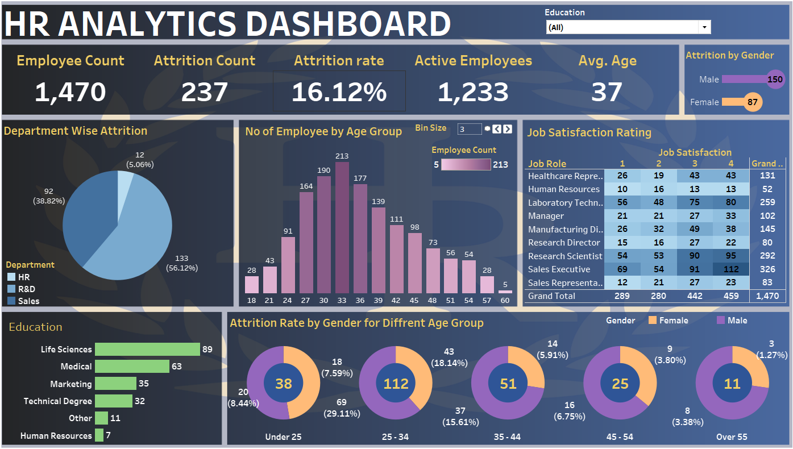

# HR Analytics Dashboard

---

## 📌 Overview
This project is an **HR Analytics Dashboard** built using **Tableau** to monitor employee attrition, demographics, job satisfaction, and other HR metrics. It enables HR professionals to identify trends, reduce attrition, and improve workforce planning.

---

## ✅ Key Metrics & Insights
- **Employee Count:** 1,470  
- **Attrition Count:** 237  
- **Attrition Rate:** 16.12%  
- **Active Employees:** 1,233  
- **Average Age:** 37 years  
- **Department-wise Attrition:** Highest in R&D (56.12%)  
- **Education Split:** Life Sciences & Medical are most common  
- **Gender-wise Attrition by Age:** Detailed segmentation using donut charts  
- **Job Satisfaction:** Ratings broken down by job role  

---

## 📊 Dashboard Features
- **Filters:** Interactive filter by Education  
- **Visual Components:**  
  - Pie Chart → Department-wise Attrition  
  - Histogram → Employee Age Distribution  
  - Donut Charts → Attrition Rate by Gender & Age Group  
  - Heatmap → Job Satisfaction by Role  
- **KPIs:** Employee Count, Attrition Rate, Average Age, etc.  

---

## 🗂️ Repository Contents
- `HRdashboard.PNG` → Screenshot of the dashboard  
- `HR Data.xlsx` → Sample HR dataset  

---

## ▶ How to View or Run the Dashboard

##View the interactive dashboard via **Tableau Public**:  
**👉 [View Dashboard on Tableau Public](https://public.tableau.com/app/profile/shanmukha.sai.bada/viz/HRANALYTICSDASHBOARD_17565075358660/HrAnalyticsDashboard)**  

## 🛠 Data Source
- File: `HR Data.xlsx`  
- Contains: Employee demographics, education, department, job role, age, and attrition status.  

---

## ✍ Author
SHANMUKHA SAI BADA – Business Analyst / Data Analyst  
📧 Contact: [badashanmukhasai@gmail.com]  
🔗 LinkedIn: [https://www.linkedin.com/in/shanmukha-sai-bada/]  

